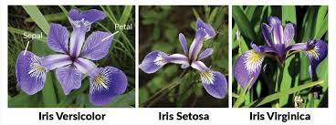

# Iris Flowers Classification ML Project

## Introduction

This project aims to predict the optimum number of clusters for the Iris dataset using the K-Means clustering algorithm and represent it visually. The Elbow method is used to determine the optimal number of clusters.



## Dataset

The Iris dataset contains 150 samples from each of three species of Iris flowers (Iris setosa, Iris virginica, and Iris versicolor). Four features were measured from each sample:

- Sepal length

- Sepal width

- Petal length

- Petal width

## Project Steps

### Exploratory Data Analysis

1. Load the Iris dataset.

2. Explore the dataset to understand its structure and check for null values.

3. Visualize the data using histograms and pair plots.

4. Compute and visualize the correlation matrix.

### Preprocessing the Data

1. Convert the categorical target variable (species) into numerical values using Label Encoding.

2. Drop unnecessary columns (Id and Species).

3. Rename columns for better readability.

4. Standardize the features to ensure they are on a similar scale.

### K-Means Modelling

1. Determine the optimal number of clusters using the Elbow method.

2. Fit the K-Means model to the data with the optimal number of clusters.

3. Visualize the clusters and their centroids.

## Requirements

- Python 3.x

- pandas

- numpy

- scikit-learn

- matplotlib

- seaborn

## Usage

1. Clone the repository:

   ````bash

   git clone https://github.com/yourusername/iris-clustering.git

   cd iris-clustering

   ````

2. Install the required packages:

   ````bash

   pip install -r requirements.txt

   ````

3. Run the project:

   ````bash

   python iris\_clustering.py

   ````

## Conclusion

This project demonstrates the use of the K-Means clustering algorithm to classify Iris flowers into three clusters. The Elbow method helps in determining the optimal number of clusters. The resulting clusters are visualized to understand the distribution and centroids.

## License

This project is licensed under the MIT License - see the LICENSE file for details.

## Acknowledgements

- The Iris dataset used in this project is a classic dataset in the field of machine learning and is available from the UCI Machine Learning Repository.

- This project was inspired by common data science exercises and tutorials that use the Iris dataset.

